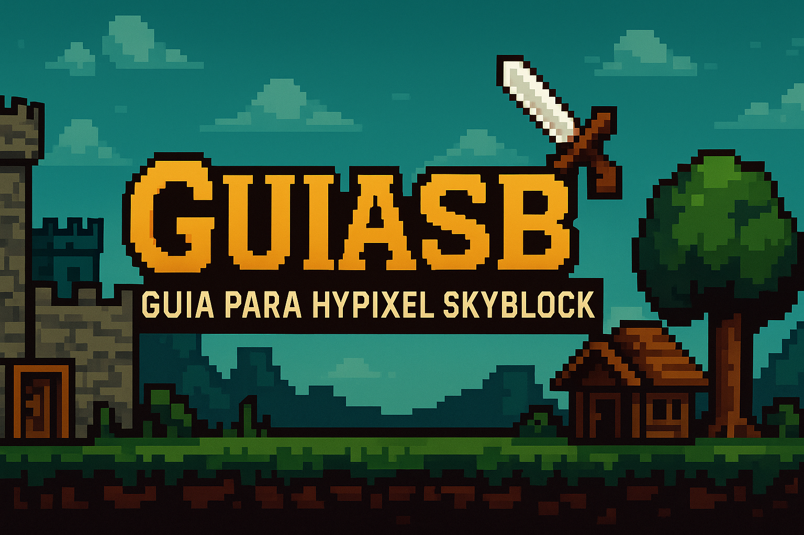

# 📘 Nome do Projeto

 

Uma descrição breve e impactante do seu projeto.  
Ex: Um guia visual completo e responsivo sobre Hypixel SkyBlock, feito com Next.js + Tailwind.

---

## 📌 Índice

- [📘 Sobre o Projeto](#-sobre-o-projeto)
- [🚀 Tecnologias](#-tecnologias)
- [📂 Estrutura de Pastas](#-estrutura-de-pastas)
- [🛠️ Como Rodar o Projeto](#️-como-rodar-o-projeto)
- [🌐 Deploy](#-deploy)
- [🤝 Contribuindo](#-contribuindo)
- [📄 Licença](#-licença)
- [📬 Contato](#-contato)

---

## 📘 Sobre o Projeto

Descreva claramente o propósito, os problemas que ele resolve e para quem ele é útil.

Exemplo:
> O GuiaSB foi criado para ajudar jogadores brasileiros do Hypixel SkyBlock a entender e dominar as mecânicas do jogo, oferecendo conteúdo didático e atualizado sobre builds, reforges, slayers e muito mais.

---

## 🚀 Tecnologias

Liste as tecnologias principais usadas no projeto:

- ⚛️ **React / Next.js**
- 🧠 **TypeScript**
- 🎨 **Tailwind CSS**
- 🔒 **ESLint / Prettier**
- 🌐 **Netlify / Vercel** (para deploy)

---

## 📂 Estrutura de Pastas

```bash
GuiaSB/
├── app/               # Páginas (Next 13+)
├── components/        # Componentes reutilizáveis
├── lib/               # Funções utilitárias
├── public/            # Imagens e arquivos públicos
├── styles/            # Arquivos de estilo
├── README.md          # Este arquivo mesmo
└── ...
```

---

## 🛠️ Como Rodar o Projeto

```bash
# Clone o repositório
git clone https://github.com/seu-usuario/seu-repositorio.git

# Acesse a pasta do projeto
cd nome-do-projeto

# Instale as dependências
npm install

# Rode o servidor local
npm run dev

# Acesse: http://localhost:3000
```
---

## 📄 Licença

Esse projeto está sob a licença MIT. Veja o arquivo [LICENSE](LICENSE) para mais detalhes.

---
